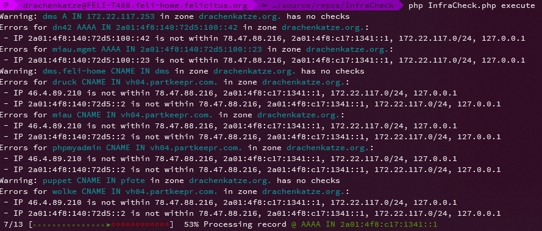

# InfraCheck

This is a minimalistic tool to help with migration and verification of DNS-based services. It was developed to aid with
moving services from multiple servers to a single one, while checking if each and every service in DNS is reachable. It
also helped me with removing old DNS entries no longer in use.

# Usage

Paste your zone files into the `config/zones` directory. Create a new config for each zone by running
`php InfraCheck.php generate-zonefile <zonefile>`. See the `config/zonefiles` directory for the configs
I use on my own.

# Documentation

Sorry, no documentation. This is a simple hacked together tool for personal use and not intended as a fully functional
tool. As such, I don't accept bug reports and feature requests, and it is provided as-is.